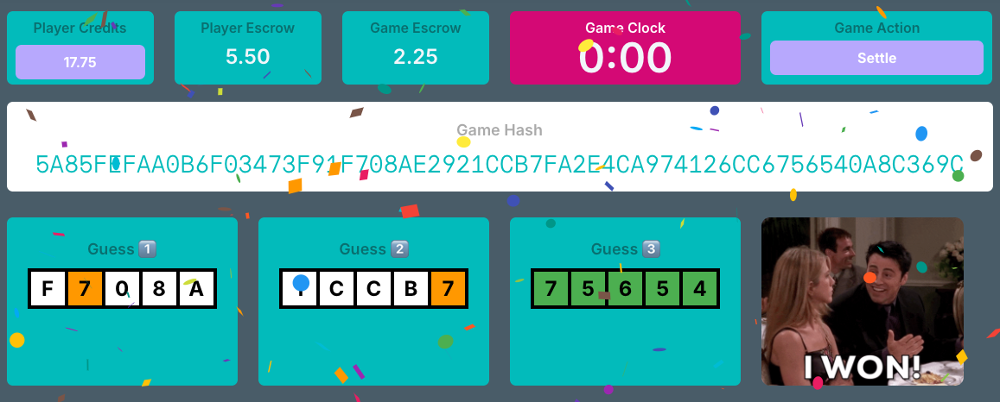

# Hashdle FAQ

**Play Hashdle at [https://hashdle.com](https://hashdle.com)**

---

## How to Play

### What is Hashdle?

Hashdle is a fun, Play-to-Earn, skill-based game where you guess a secret five-letter sequence from a 64-letter transaction "Hash" in three or fewer guesses within two minutes.

### Is there a demo video?

Yes! Watch our 2.5-minute demo video to see how Hashdle works at [hashdle.com](https://hashdle.com).

### How do the color hints work?

Each guess gives you color-coded feedback:

- 🟩 **Green**: Right letter in the right place
- 🟧 **Orange**: Right letter but wrong place (Hint Fee = 0.25 Credits each)
- ⬜️ **White**: Wrong letter (Hint Fee = 0.50 Credits each)

### How long do I have to solve it?

You have **two minutes** from when the game starts to make your guesses. If time runs out, the game expires and you'll need to click "Settle" to finalize.

### What letters can be in the hash?

The secret sequence uses hexadecimal characters: **0-9 and A-F**. All letters are automatically made uppercase.

---

## Prizes & Fees

### How much can I win?

Your prize depends on which guess you win on:

- **Guess 1**: 5 Credits 🟩🟩🟩🟩🟩
- **Guess 2**: 4 Credits 🟩🟩🟩🟩🟩
- **Guess 3**: 3 Credits 🟩🟩🟩🟩🟩

The faster you solve it, the bigger the prize!

### What are Hint Fees?

Every time you get a color hint (orange or white), you pay a small fee from your escrowed credits:

- Orange tiles (right letter, wrong place): 0.25 Credits each
- White tiles (wrong letter): 0.50 Credits each
- Green tiles (correct): No fee

These fees are deducted from your 5 Credit escrow as you play.

### How does the escrow work?

When you start a game, both you (Player) and the Game escrow 5 Credits each. Your 5 Credits are used to pay Hint Fees as you play. If you win, you get your remaining Credits back plus the prize from the Game escrow.

---

## Game Rules

### What does "Settle" mean?

You **must click "Settle"** to finalize any game and release escrowed Credits back to your account. This applies whether you win, lose, or let the game expire.

### Can I cancel a game without paying fees?

Yes! If you click "Settle" before submitting any guesses and before the game expires, you won't be charged any fees. Your escrowed Credits will be fully refunded.

### What happens if time runs out?

If the two-minute timer expires before you solve the puzzle, the game ends. You'll need to click "Settle" to finalize. Any Hint Fees you paid are kept by the house, and your remaining escrowed Credits are returned. You have to do this before you can start a new game.

### Can I play if the prize pool is empty?

No. The game requires at least 5 Credits in the prize pool to be playable. This ensures there are always Credits available for winners.

---

## Credits & Blockchain

### What blockchain does Hashdle use?

Hashdle runs on the **Vitruveo blockchain**, a fast and low-cost EVM-compatible network.

### How do I add Vitruveo to my wallet?

If you haven't added Vitruveo to your wallet yet, you can add it automatically from [Chainlist](https://chainlist.org/?search=vitruveo), or add it manually with these details:

- **Network Name:** Vitruveo
- **Chain ID:** 1490
- **Currency Symbol:** VTRU
- **RPC URL:** https://rpc.vitruveo.xyz
- **Block Explorer:** https://explorer.vitruveo.net

### How do I get Credits?

To get Credits, you need **USDC.pol** tokens on Vitruveo:

1. Add Vitruveo network to your wallet (see above)
2. Bridge USDC.pol from popular EVM networks at [https://vitruveo.protousd.com/](https://vitruveo.protousd.com/)
3. Connect your wallet to Hashdle
4. Go to the Credits page to deposit USDC.pol and convert to Credits (1:1 ratio, no fees)

### How do I manage my Credits?

Visit the Credits page to:

- **View balances**: See your USDC.pol and Credit balances
- **Deposit**: Convert USDC.pol to Credits (1:1, no fees) in multiples of 1
- **Withdraw**: Convert Credits to USDC.pol (1:1, no fees) - any amount up to your balance

### Are there any fees for deposits or withdrawals?

No! Both deposits and withdrawals are **completely fee-free**. Credits convert 1:1 with USDC.pol in both directions. The only cost is the minimal blockchain gas fee (VTRU).

### What about gas fees (VTRU)?

If the game detects that you don't have any VTRU in your account for gas, it automatically sends you a small amount so you can play. No action needed on your part!

### How many Credits do I need to play?

You must have at least **5 Credits** in your account to start a game. These Credits are escrowed during gameplay and released when you settle.

### Can I withdraw fractional Credits?

Yes! While deposits must be in multiples of 1 Credits, you can withdraw **any amount** up to your total Credit balance, including fractional amounts like 4.5 Credits.

---

## Important Information

### Are actions reversible?

No. **All actions are final, irreversible, and non-refundable.** This is because all game actions are recorded on the blockchain and cannot be undone.

### How do I contact you?

You can email us at [hashdlegame@gmail.com](mailto:hashdlegame@gmail.com). Please note that we may not be able to reply to all inquiries.

